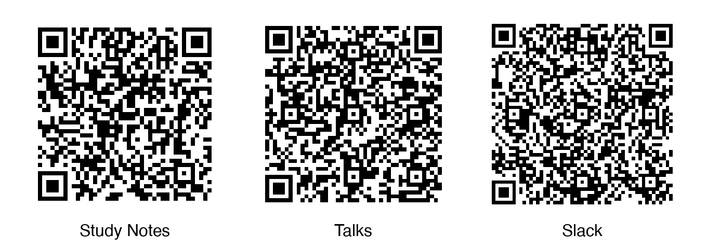

# Systematically Improving RAG

Building reliable, production-grade retrieval-augmented generation.

 

By Jason Liu

---

# Introduce yourself!

- Where are you calling in from?
- Are you working on a project right now?
- What are your goals for the course?

---

# Today’s Plan

- Introductions
- About me; consulting and training
- Who are you?
- Format & office hours
- Key insights & course outcomes
- What’s changed since v1 (2024)
- Syllabus (Sessions 0–3)
- Syllabus (Sessions 4–6)
- Resources & contributions
- Q&A and next steps

---

# About Me (Jason Liu)

- University of Waterloo (2012–2017):
  - Computational Mathematics, Mathematical Physics
  - Computational linear algebra → compression/embedding models → retrieval and deep learning
- Meta (2017):
  - Content policy/moderation, public risk & safety
  - Built dashboards and search tools to surface harmful content
- Stitch Fix (2018–2023):
  - CV + multimodal retrieval
  - VAEs/GANs for GenAI
  - ~$50M incremental revenue
  - led ~$400K/yr data curation for next‑gen models

---

# Consulting and Training

- Personal note: Hand injury (2021–2022) → shifted focus to higher‑leverage teaching and advising
- Consulting (2023–present): Query understanding, prompts, embedding search, fine‑tuning, MLOps/observability; upgrading legacy workflows to agentic systems
- Clients: HubSpot, Zapier, Limitless, and others across assistants, construction, research

---

# Format & Office Hours

- Inverted classroom: ~6 hours pre‑recorded lectures + tutorial videos
- Tutorials/Notebooks: Jupyter exercises to tackle between sessions
- Slack: post questions in the cohort channel for async help
- Welcome to share your learnings online via linked in or twitter (please link back to us some how)

<v-click>

## Office hours:

- bring your problems, introduce yourself.
- treat it like a tech‑lead review of your work
- cameras on is really appreciated! helps me a lot.
- Guest lectures: 1-2 times a week, practitioners actively building in the space.

</v-click>

<v-click>

## Logistics

- Scheduling: occasional reschedules (e.g., OpenAI Dev Day); advance notice
- Credits/support: contact Marian — support at jxnl.co (support@jxnl.co)

</v-click>

---

# Key Insights & Course Outcomes

This course will give you the foundations and practical skills to build, evaluate, and operate retrieval-augmented generation (RAG) systems. Here’s what to keep in mind and what you’ll learn:

### Keep these in mind

- Good retrieval will often beat clever prompting.
- Similarity is subjective, train for your specific goals.
- Feedback is fuel, design your UX to capture useful signals.
- Specialized indices often outperform one-size-fits-all solutions (though this is shifting as contexts/tools evolve).
- Segmenting queries and users to prioritize work and build a roadmap.
- Production matters, cache, monitor, and degrade gracefully.

---

# The Models are Good but Context Is the Bottleneck

<v-click>

- Models are already very capable for work.
- Even if models hold steady, apps can still improve.
- With the right context, success rates are very high.
- The real challenge is getting that context — the R in retrieval.

</v-click>

---

# What’s Changed Since v1 (2024)

Lets talk more about this in the office hours!

- Since Claude 3.5, tools/agents are much more reliable; planning loops keep improving
- Code assistants (e.g., Claude Code) excel at code RAG flows: grep + edit with validation
- Prompt caching widespread; longer contexts change cost/latency tradeoffs
- Better PDF/diagram extraction; richer citations in UIs (bounding boxes)
- Shift from one‑off evals to continuous testing and monitoring over time
- Always a tradeoff: performance × latency × cost; be mindful of pricing impacts
- “Context engineering” is emerging; 2026 update of this course will focus more here

---

# Syllabus (Sessions 0–3)

- Session 0: Product mindset; RAG as a recommender; improvement flywheel
- Session 1: Synthetic data and retrieval evals; precision/recall; baselines
- Session 2: From evals to training data; reranking; embedding fine-tuning
- Session 3: UX that collects data; streaming; chain of thought; validation
  - Pacing note: Week 3 is intentionally lighter—use it to catch up and get ahead
  - Focus on UX patterns; not the most critical week content‑wise

<v-click>

## Main takeaway

- fast retrieval evals (precision/recall on key chunks)
- rerank/fine‑tune to get a 10-20% improvement
- deploy and collect real data via UX

</v-click>

---

# Syllabus (Sessions 4–6)

- Session 4: Topic modeling; query segmentation; prioritization frameworks
- Session 5: Specialized indices; multimodal search (docs, images, tables, SQL)
- Session 6: Query routing; tools-as-APIs; single vs multi-agent; measurement
  - Week 6 is lighter; focus on routing and preview the context‑engineering direction

<v-click>

## Main takeaway

- Figure out whats important to you and your users
- Build specialized indices for those usecases
- Make sure the Agent is able to use the specialized indices

</v-click>

---

# Resources & Contributions

Feel free to share this with coworkers, but don't post these links on social media. You can completely welcome to write your own notes and share them online! (Please link back to us some how)

<v-click>

## Resources

- Study notes (work in progress): https://567-labs.github.io/systematically-improving-rag/
- Talks/"greatest hits": https://567-labs.github.io/systematically-improving-rag/talks/
- Slack: https://join.slack.com/t/improvingrag/shared_invite/zt-3dkinqb3q-vknvaBLoTx5tBj4PpGOVjw
- Contribute via PRs/issues; add examples; suggest edits
</v-click>

<v-click>

## Recommendations

- Skylar’s RAG anti‑patterns Talk
- Anton's Text Chunking Strategies Talk
- Exa's Why Google Search Sucks for AI Talk
- Colin's Agentic RAG Talk
</v-click>

---

# Q&A

Short Q&A and then we'll let you watch the first video.
